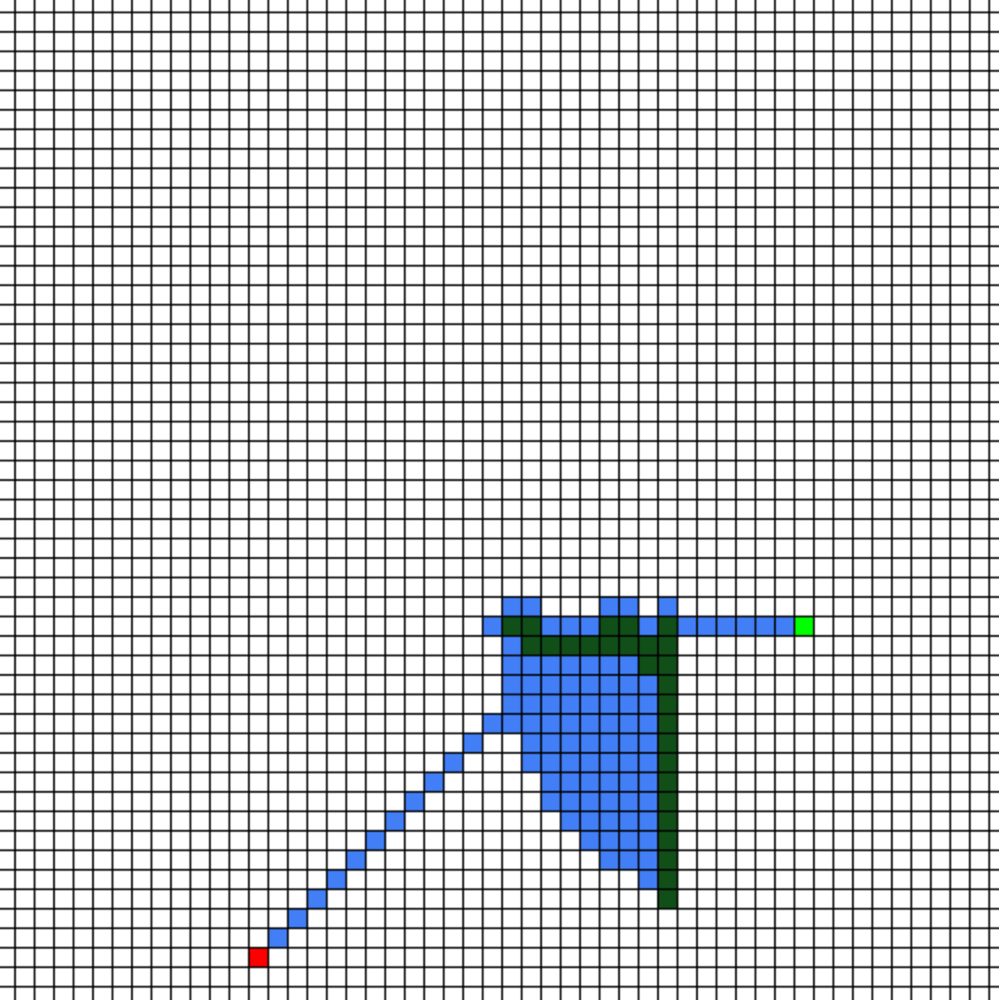

# A* Pathfinder algorithm implementation 
- Used pygame to create a grid
- STARTING POINT and TARGET point are randomly chosen each game
- User can click and drag any where in the grid to create barriers 
- Once the user is done creating barriers, press 'w'
- A* algorithm will find the shortest path between STARTING POINT and TARGET, given the constraints 
 
